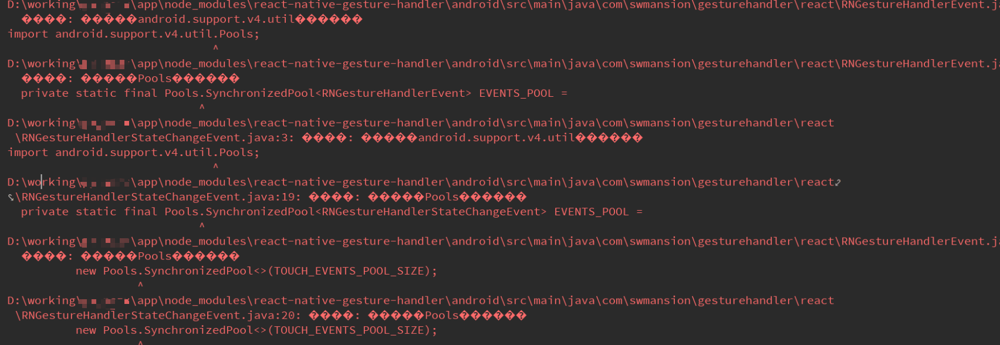

# rn-curiosity

#rn-curiosity，原生工具集合 详见NativeUtils

 react-native >0.60.0
```

  yarn add rn-curiosity
 
```
 
 react-native <0.59
```
   yarn add rn-curiosity

   react-native link rn-curiosity 
```
0.60以下版本Android编译会报错 
```
   import androidx . annotation. Nullable;
```
需要在 android/gradle.properties 文件下
加入以下代码
```

   android.useAndroidX=true
   android.enableJetifier=true
   
```


#方法 NativeUtils
[参考NativeUtils文件](src/NativeUtils.js)


#热更新
```
 *分别在android & ios bundle.zip 中加入version.json文件，

 version.json  * 用于匹配当前app版本号和bundle内app版本号是否匹配，不匹配则删除 bundle.zip

 {
   appVersion:1  //版本号为android:versionCode   ios:Build
 }
```


Android:
[参考ApplicationTest](android/src/main/java/com/curiosity/ApplicationTest.java)

    
```

   android/app/src/com/包名/MainApplication 中加入以下代码
   
   
       
   import com.curiosity.NativeTools;
   import java.io.File;
   
   
   public class MainApplication extends Application implements ReactApplication {
     
     ...
     private final ReactNativeHost mReactNativeHost = new ReactNativeHost(this) {
        
       ...
       /*
        * bundle加载判断
        * */
       @Override
       protected String getJSBundleFile() {
         if (NativeTools.isBundle(getApplicationContext()) && NativeTools.matchingVersion(getApplicationContext())) {
           File file = new File(NativeTools.getFilesDir(getApplicationContext()) + "/bundle/index.bundle");
           return file.getAbsolutePath();
         } else {
           return super.getJSBundleFile();
         }
       }
       ...
       
      };
      ...
      
    }
   
```


IOS:

[参考AppDelegateTest](ios/AppDelegateTest.m)

[IOS 运行http请求文件配置信息](ios/ioshttp.png)

```
//热更新导入头部

#import "RNCuriosity.h"


热更新 react-native 0.40>&&<0.59

- (void)application:(UIApplication *)application didRegisterForRemoteNotificationsWithDeviceToken:(NSData *)deviceToken
{

...
NSURL *jsCodeLocation;
#ifdef DEBUG
    jsCodeLocation = [[RCTBundleURLProvider sharedSettings] jsBundleURLForBundleRoot:@"index" fallbackResource:nil];
#else

   if([NativeTools isBundle]&&[NativeTools matchingVersion]){
        jsCodeLocation=[NativeTools urlBundle];
    }else{
        jsCodeLocation =[[RCTBundleURLProvider sharedSettings] jsBundleURLForBundleRoot:@"/index" fallbackResource:nil];
   }
#endif

...

  [NativeTools showSplashScreen];  //开启启动屏
  return YES;
}


热更新 react-native >0.59
...
- (NSURL *)sourceURLForBridge:(RCTBridge *)bridge
{
#if DEBUG
   return [[RCTBundleURLProvider sharedSettings] jsBundleURLForBundleRoot:@"index" fallbackResource:nil];
#else
    if([RNCuriosity isBundle]&&[RNCuriosity matchingVersion]){
       return [RNCuriosity urlBundle];
   }else{
        return [[NSBundle mainBundle] URLForResource:@"main" withExtension:@"jsbundle"];
    }
#endif
}
...

```

Android问题解决

android react-native-gesture-handler 编译爆红



``` 
   问题： 程序包android.support.v4 不存在
   
   原因： 0.60.0以下旧版本无法兼容 AndroidX  
 
   解决办法： （所有v4包找不到的问题 都可用此办法，如果yarn或者npm后，都需要执行以下代码）
  
   npm install --save-dev jetifier （如若已安装jetifier 可省略此步骤）
   
   npx jetify
   
   cd android && ./gradlew clean
   
   react-native run-android
   
```

   如果你安装新的第三方库 一定要执行
   
   npx jetify


android 9.0 无法请求接口问题解决

```
android/src/main/AndroidManiTest.xml  中加入代码

  
<manifest xmlns:android="http://schemas.android.com/apk/res/android"
    package="com.happylife">

    <uses-permission android:name="android.permission.INTERNET" />
 
    <application
        android:name=".MainApplication"
        android:allowBackup="false"
        android:icon="@mipmap/ic_launcher"
        android:label="@string/app_name"
        android:networkSecurityConfig="@xml/network_config"     //加入代码
        android:roundIcon="@mipmap/ic_launcher_round"
        android:theme="@style/AppTheme">
        <activity
            android:name=".MainActivity"
            android:configChanges="keyboard|keyboardHidden|orientation|screenSize"
            android:label="@string/app_name"
            android:windowSoftInputMode="adjustResize">
            <intent-filter>
                <action android:name="android.intent.action.MAIN" />
                <category android:name="android.intent.category.LAUNCHER" />
            </intent-filter>
        </activity>
        <activity android:name="com.facebook.react.devsupport.DevSettingsActivity" />
    </application>

</manifest>


```
版本更新记录
3.0.5
加入android sql操作，增删改 以及sql语句（ios端后续加入）
