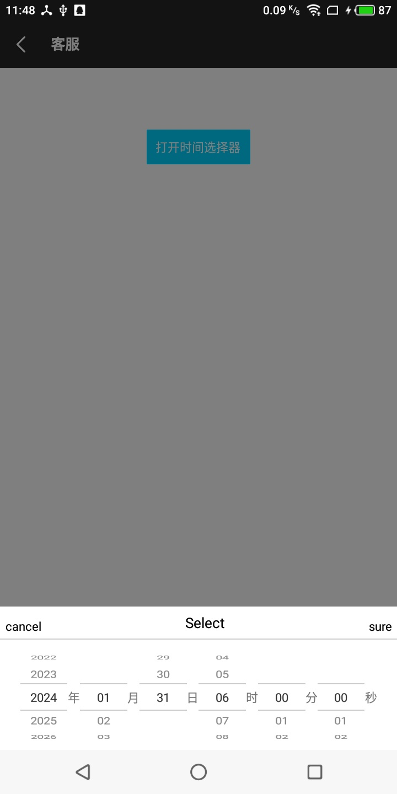
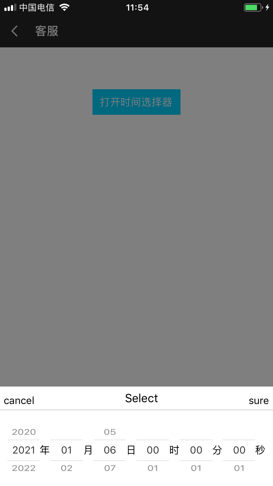

# rn-curiosity

### rn-curiosity 致力于快速搭建app，封装多个常用 组件 方法，统一管理。同时会慢慢加入更多功能和组件，如问题 可及时提issues , 


## 必须加入的库
`$  npm install rn-curiosity --save`

`$  npm install rn-fetch-blob --save`      

`$  npm install @react-native-community/async-storage --save`

`$  npm install @react-native-community/netinfo --save`

`$ react-native link`

##推荐使用的库
```

 npm install react-native-fast-image --save`  //大图片优化

 react-native-syan-image-picker --save//图片选择
 
 lottie-react-native 动画库
```

##所有组件方法导入方式
rn-curiosity 继承 react-native 、react-native-snap-carousel、@react-native-community/netinfo、@react-native-community/async-storage 全部组件和方法
```

import {TouchView, Utils, View, React, Component} from "rn-curiosity";

```
###组件


继承  <TouchableOpacity/> 加入200ms 延迟点击
```html
<TouchView/> 
```
继承  TouchView  内部居中
```html
<CenterView/> 
```
继承  CenterView
```html
<CustomButton
      buttonStyle={{}}    //外部View样式
      textStyle={{}}      //内部Text样式
   /> 
```
    

         
继承  CenterView
```html
<CustomImage
       buttonStyle={{}} //有onPress 属性
       style={{}}       //无onPress 时 等同于Image组件
   />

```
   
   
继承 ImageBackground
```html
<CustomImageBackground/>
```

   
   
Checkbox
```html
<CustomCheckbox
      onChange={(check)=>{
         //
      }}
      checkedIcon={ }     //选中时 的图片
      uncheckedIcon={  }  //未选中时 的图片
      checked={  }        // 默认状态
   />
```
   
首页TabBar
```html
   <TabBarItem/>
```
渐变组件   
```html

   <LinearGradient
       horizontal={true}
       colors={['#000000', '#ffffff']}
       viewStyle={{
           flexDirection: 'row',
           height: Constant.CurrentHeight + Utils.getHeight(100),
           paddingTop: Constant.CurrentHeight,
           alignItems: 'center',
           width: Screen_Width,
           justifyContent: 'space-between',
           paddingHorizontal: Utils.getWidth(25),
       }}
       style={{}}>
   </LinearGradient>
``` 
单线动画
```html
  <BarLine
    progress={this.state.progress}  //0 ~ 1
    style={{
        width: this.width,
        unfilledColor: Colors.gray999,
        color: Colors.blueStart,
    }}/>}

```

时间选择器 
```html
 <DatePicker/>
```



#属性

```pickerType || 'dateTime'  类型  

   
    /* pickerType:
     *       date        =>年月日选择
     *       dateTime    =>年月日时分秒选择
     *       time        =>时分秒选择
     */
     
 itemHeight         单层item高度
 
 title || 'Select'  头部文字
 
 cancelTextStyle    取消文字样式
 
 cancelTouchStyle   取消触摸区域样式
 
 sureTextStyle      确定文字样式
 
 sureTouchStyle     确定触摸区域样式
 
 titleTextStyle     头部文字样式
 
 showUnit || true  是否显示文字（年月日）
 
 pickerTimeInterval || ['2019-01-01', '2029-01-01']   选择时间区间
 ```

 
 
#事件
```
onSure     确定 回调

onCancel   取消 回调
```


#例

```
 Utils.alertPicker('date', '确定', '时间选择器', '取消', (time) => {
                            //确定 返回（time）
                        }, () => {
                            //取消
                        })
```    

###常量
加入多个原生app信息[详见Constant](src/BaseConstant.js)
```
import {FontSize, Colors, Constant,} from "rn-curiosity";

  FontSize.textSize_20  => 7 ~ 65 字体大小
  
  Colors.mainWhite    
  
  Constant
     Constant.IOS                     //ios设备
     Constant.Android                 //android设备
     Constant.ActualScreen_Height     //屏幕实际高度 （包含全面屏和非全面屏）
     Constant.Screen_Width            //屏幕宽度
     Constant.Screen_Scale            //屏幕像素密度
     Constant.ShadowStyle             //阴影样式 （兼容ios && android）
       
``` 

###方法 Utils
[参考Utils文件](src/Utils.js)

```
  使用方法
  
  Utils.方法名()
  
  Utils.sendMessageNativeToJS()

```

##热更新

###Android[参考MainTest](android/src/main/java/com/curiosity/MainTest.java)

     android:networkSecurityConfig="@xml/network_config"
```
   android/app/src/com/包名/MainApplication 中加入以下代码
   
       /*
        * bundle加载判断
        * */
       @Override
       protected String getJSBundleFile() {
         if (NativeTools.isBundle(getApplicationContext()) && NativeTools.matchingVersion(getApplicationContext())) {
           File file = new File(NativeTools.getFilesDir(getApplicationContext()) + "/bundle/index.bundle");
           return file.getAbsolutePath();
         } else {
           return super.getJSBundleFile();
         }
       }
       
   
```
android 9.0 无法请求接口问题解决
```
android/src/main/AndroidManiTest.xml  中加入代码
  
<manifest xmlns:android="http://schemas.android.com/apk/res/android"
    package="com.happylife">

    <uses-permission android:name="android.permission.INTERNET" />
 
    <application
        android:name=".MainApplication"
        android:allowBackup="false"
        android:icon="@mipmap/ic_launcher"
        android:label="@string/app_name"
        android:networkSecurityConfig="@xml/network_config"     //加入代码
        android:roundIcon="@mipmap/ic_launcher_round"
        android:theme="@style/AppTheme">
        <activity
            android:name=".MainActivity"
            android:configChanges="keyboard|keyboardHidden|orientation|screenSize"
            android:label="@string/app_name"
            android:windowSoftInputMode="adjustResize">
            <intent-filter>
                <action android:name="android.intent.action.MAIN" />
                <category android:name="android.intent.category.LAUNCHER" />
            </intent-filter>
        </activity>
        <activity android:name="com.facebook.react.devsupport.DevSettingsActivity" />
    </application>

</manifest>


```

###IOS[参考AppDelegateTest](ios/AppDelegateTest.m)
[ios 运行http请求文件配置信息](ios/ioshttp.png)

```

热更新 react-native 0.46>&&<0.59
- (void)application:(UIApplication *)application didRegisterForRemoteNotificationsWithDeviceToken:(NSData *)deviceToken
{

...
NSURL *jsCodeLocation;
#ifdef DEBUG
    jsCodeLocation = [[RCTBundleURLProvider sharedSettings] jsBundleURLForBundleRoot:@"index" fallbackResource:nil];
#else

   if([NativeTools isBundle]&&[NativeTools matchingVersion]){
        jsCodeLocation=[NativeTools urlBundle];
    }else{
        jsCodeLocation =[[RCTBundleURLProvider sharedSettings] jsBundleURLForBundleRoot:@"/index" fallbackResource:nil];
   }
#endif

...

  [NativeTools showSplashScreen];  //启动屏
  return YES;
}


热更新 react-native >0.59
...
- (NSURL *)sourceURLForBridge:(RCTBridge *)bridge
{
#if DEBUG
   return [[RCTBundleURLProvider sharedSettings] jsBundleURLForBundleRoot:@"index" fallbackResource:nil];
#else
    if([RNCuriosity isBundle]&&[RNCuriosity matchingVersion]){
       return [RNCuriosity urlBundle];
   }else{
        return [[NSBundle mainBundle] URLForResource:@"main" withExtension:@"jsbundle"];
    }
#endif
}
...

```
###JS调用热更新

[参考Utils文件uploadBundle方法](src/Utils.js)
```
    /**
     *
     * netVersion={
     *     androidBundleVersion:0,
     *     androidVersion:1,
     *     iosBundleVersion:0,
     *     iosVersion:1,
     *   }
     * OSS目录文件
     *
     * ├── OSS
     *      ├──android
     *            ├──bundle
     *                 ├── 0  (版本号)
     *                     └──bundle.zip
     *                 ├── 1  (版本号)
     *                     └──bundle.zip
     *                 ├── 2  (版本号)
     *                     └──bundle.zip
     *            ├──apk
     *                 ├── 0  (版本号)
     *                     └──0.apk
     *                 ├── 1  (版本号)
     *                     └──1.apk
     *                 ├── 2  (版本号)
     *                     └──2.apk
     *       ├──ios
     *            ├──bundle
     *                 ├── 0  (版本号)
     *                     └──bundle.zip
     *                 ├── 1  (版本号)
     *                     └──bundle.zip
     *                 ├── 2  (版本号)
     *                     └──bundle.zip
     *            ├──ipa     //分发平台版本号
     *                 ├── 0  (版本号)
     *                     └──0.apk
     *                 ├── 1  (版本号)
     *                     └──1.apk
     *                 ├── 2  (版本号)
     *                     └──2.apk
     *            ├──store_ipa  //官方版本号
     *                 ├── 0  (版本号)
     *                     └──0.apk
     *                 ├── 1  (版本号)
     *                     └──1.apk
     *                 ├── 2  (版本号)
     *                     └──2.apk
     *
     * @param netVersion
     * @param OSSUrl
     */
    static uploadBundle(netVersion, OSSUrl) {
        this.getAppInfo((appInfo) => {
                const localVersionCode = appInfo.versionCode
                if (Constant.Android) {
                    const fileDir = appInfo.fileDir + '/'
                    Utils.findData('androidBundleVersion', (bundleVersion) => {
                        if ((Number(netVersion.androidVersion)) === localVersionCode && (Number(netVersion.androidBundleVersion)) > bundleVersion) {
                            this.downloadFile(OSSUrl + 'android/bundle/' + Number(netVersion.androidBundleVersion) + '/bundle.zip', fileDir, 'bundle.zip', (progress) => {
                            }, (finish) => {
                                Utils.unZipFile(fileDir + 'bundle.zip', (data) => {
                                    if (data === 0) {
                                        Utils.saveData('androidBundleVersion', (Number(netVersion.androidBundleVersion)))
                                    }
                                })
                            }, (callbackFail) => {
                                Utils.cleanCache()
                            })
                        } else if ((Number(netVersion.iosVersion)) === localVersionCode && (Number(netVersion.iosBundleVersion)) < bundleVersion) {
                            Utils.cleanCache()
                        }
                    }, (error) => {
                        Utils.saveData('androidBundleVersion', 0)
                        Utils.uploadBundle(netVersion,OSSUrl)
                    })

                } else if (Constant.IOS) {
                    const libraryDirectory = appInfo.LibraryDirectory + '/'
                    Utils.findData('iosBundleVersion', (bundleVersion) => {
                        if ((Number(netVersion.iosVersion)) === localVersionCode && (Number(netVersion.iosBundleVersion)) > bundleVersion) {
                            this.downloadFile(OSSUrl + 'ios/bundle/' + Number(localVersionCode) + '/bundle.zip', libraryDirectory, 'bundle.zip', (progress) => {
                                }, (finish) => {
                                    this.unZipFile(libraryDirectory + 'bundle.zip', (data) => {
                                        if (data === 0) {
                                            Utils.saveData('iosBundleVersion', (Number(netVersion.androidBundleVersion)))
                                        }
                                    })
                                },
                                (callbackFail) => {
                                    this.cleanCache()
                                }
                            )
                        } else if ((Number(netVersion.iosVersion)) === localVersionCode && (Number(netVersion.iosBundleVersion)) < bundleVersion) {
                            this.cleanCache()
                        }
                    }, (error) => {
                        this.saveData('iosBundleVersion', 0)
                        this.uploadBundle(netVersion,OSSUrl)
                    })
                }
            }
        )
    }

```


